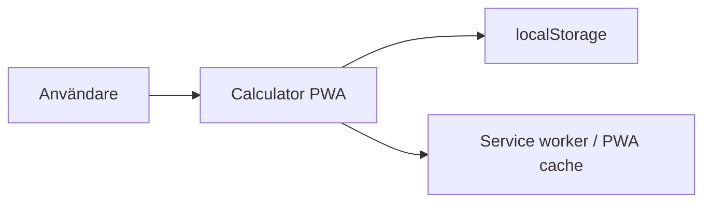
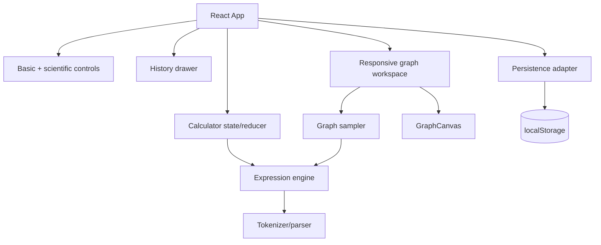

# Arkitektur – Calculator PWA v1

## 1. Arkitekturmål

Arkitekturen ska stödja följande mål i prioriterad ordning:

1. **Korrekt och testbar beräkningslogik** – matematiska regler ska vara isolerade från presentationen och kunna verifieras med omfattande enhetstester.
2. **Enkelt grundflöde utan separata användarlägen** – grundläggande räkning ska vara direkt tillgänglig, medan vetenskapliga funktioner exponeras responsivt eller på begäran.
3. **Full lokal funktion** – all kärnfunktionalitet ska fungera utan backend och, efter första lyckade laddningen, utan nätverk.
4. **Responsivt och tillgängligt gränssnitt** – samma kodbas ska fungera på mobil, surfplatta och desktop med både pekskärm och tangentbord.
5. **Liten drift- och beroendeyta** – inga serverkomponenter, databaser eller externa API:er ska krävas för v1.
6. **Förutsägbar uppdatering** – en ny PWA-version ska inte bytas mitt under en pågående beräkning.

## 2. Systemkontext

Calculator PWA är en helt klientbaserad webbapplikation. Den enda primära aktören är användaren.



## 3. Huvudkomponenter



### Expression engine

`src/calculator/engine` är UI-oberoende och ansvarar för tokenisering, parser, matematiska funktioner, felklassificering och variabelvärden. `evaluateExpression` tar ett explicit evalueringskontext där `x` kan anges. Vanliga numeriska uttryck använder samma API utan variabelkontext.

### Graph sampler

`src/calculator/graph/sampleGraph.ts` utvärderar samma uttryck upprepade gånger över ett viewport-intervall och producerar ritbara kurvsegment. Punktvisa matematiska fel bryter ett segment utan att avbryta hela grafen. En enkel hoppheuristik undviker uppenbara falska linjer över asymptoter.

### GraphCanvas

`GraphCanvas` konsumerar redan samplade segment och ansvarar endast för presentation: matematiska koordinater till pixlar, grid, axlar, kurvritning och device-pixel-ratio. Komponenten är theme-aware och frikopplad från sampling och kalkylatorstate.

### Responsiv grafarbetsyta

Grafstöd introducerar inte ett separat kalkylatorläge. Ett uttryck som innehåller identifieraren `x` betraktas som grafbart.

I porträtt behålls den kompakta kalkylatorn och grafen ritas inte; användaren får en diskret indikation om att grafen visas i landskap. I landskap är vänsterkolumnen stabil och innehåller display, verktygsrad och sifferknappsats. Högerkolumnen är en sekundär arbetsyta:

- utan `x` visas vetenskapliga funktioner,
- med `x` visas grafen automatiskt,
- `Funktioner` kan tillfälligt ersätta grafen i högerkolumnen utan att vänsterkolumnen eller sifferknappsatsen flyttas.

Detta håller grundräknaren motoriskt stabil samtidigt som större skärmyta används för grafen.

### Calculator state

Reducer-state innehåller uttryck, resultat, råresultat, fel och `justEvaluated` tillsammans med persistenta inställningar. Grafpresentation härleds från uttrycket och lagras inte som separat användarläge. `x` behandlas som början på ett nytt uttryck efter en slutförd numerisk beräkning.

### Persistens

Persistens omfattar tema, vinkelenhet, minne och historik. Grafstate och viewport är inte persistenta i den initiala grafversionen.

## 4. Dataflöden

### Numerisk beräkning

```text
Input -> reducer -> expression -> evaluateExpression -> result -> formatter -> display/history
```

### Graf

```text
Input med x
  -> graphable expression detection
  -> sampleGraph(expression, viewport)
  -> evaluateExpression(expression, { x }) för varje sampel
  -> GraphSegment[]
  -> GraphCanvas
```

### Persistens

```text
Reducer state -> selected persistent fields -> localStorage
localStorage -> defensive parser/defaults -> initial reducer state
```

## 5. Responsiv design

Responsiviteten styr presentationen, inte matematikdomänen. Samma reducer och expression engine används i alla orienteringar.

- Smalt porträtt: sifferknappsats alltid primär, Funktioner/Historia på begäran, ingen Canvas-graf.
- Telefon i landskap: stabil kalkylatorkolumn till vänster och sekundär funktion/grafyta till höger med safe-area padding.
- Surfplatta/desktop i landskap: samma tvåområdesmodell med större sekundär grafyta.
- Historik fortsätter vara overlay/drawer och påverkar inte grafens layoutmodell.

## 6. Säkerhet och robusthet

- Ingen `eval` eller `Function` används för matematiska uttryck.
- Okända identifierare och ogiltiga uttryck ger kontrollerade parserfel.
- Grafens sampler tolererar punktvisa domänfel men propagerar strukturella syntaxfel.
- Grafkod är helt klientbaserad och introducerar inga externa API-anrop.
- localStorage läses defensivt och får inte hindra kärnfunktionen.

## 7. Teststrategi

Verifieringen sker i flera lager:

- expression-engine unit tests för matematik och `x`,
- sampler unit tests för segment och diskontinuiteter,
- Canvas/component tests för koordinatmapping, DPI och tillgängliga labels,
- reducer/UI tests för vanlig kalkylatorstate,
- Playwright för porträtt, telefonlandskap, iPad/desktop-landskap, grafaktivering, stabil knapposition, historik, tema och offline/PWA.

Interaktiv viewport-hantering (pan/zoom/reset) byggs ovanpå denna arkitektur i DEV-017 och ska hållas isolerad till grafytan.
