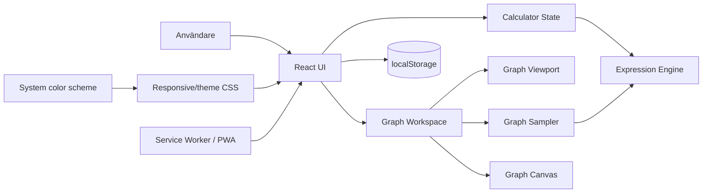

# Arkitektur – Calculator PWA

## 1. Arkitekturmål

Arkitekturen ska prioritera:

1. korrekt och testbar matematik,
2. ett enkelt grundflöde utan separata calculator modes,
3. stabil responsiv layout där grundknappsatsen inte flyttar sig när sekundär funktionalitet ändras,
4. helt lokal/offlinekapabel funktion utan backend,
5. liten dependency- och drift-yta,
6. tydliga domängränser mellan beräkning, grafprovtagning, viewportinteraktion och rendering,
7. systemstyrt tema utan onödigt applikations-state.

## 2. Systemkontext

Calculator PWA är en klientbaserad React/TypeScript-applikation som levereras statiskt och kör all matematik, grafprovtagning, rendering, viewportinteraktion och persistens lokalt i webbläsaren.



Det finns ingen backend, autentisering, serverdatabas eller extern graph service.

## 3. Huvudkomponenter

### 3.1 Application Shell / React UI

Ansvarar för:

- expression/result display,
- grundknappsats,
- `Funktioner` och `Historik`,
- DEG/RAD och minne,
- responsiv presentation,
- safe-area-hantering,
- orienterings-/viewportberoende graph workspace,
- tillgänglig semantik och input/fokus.

Applikationsheader och temaväljare ingår inte längre i kalkylatorytan. Ljust/mörkt färgschema härleds av CSS från `prefers-color-scheme`.

UI:t implementerar inte matematiska regler eller grafprovtagning.

### 3.2 Calculator State

Ansvarar för:

- aktuellt uttryck,
- numeriskt resultat/fel,
- redigering, clear/backspace och `=`,
- DEG/RAD,
- minne,
- historik.

Tema ingår inte i runtime-state. Graph presentation härleds från aktuellt uttryck och viewport och lagras inte som ett separat calculator mode. `x` behandlas som början på ett nytt uttryck efter en slutförd numerisk beräkning.

### 3.3 Expression Engine

Ansvarar för säker parser/evaluator för tal/operatorer, parenteser, procent/potenser, vetenskapliga funktioner, `π`, `e`, DEG/RAD och variabeln `x` via explicit evaluation context.

Motorn använder inte `eval`, `Function` eller dynamisk kodexekvering.

```text
evaluateExpression(expression, angleMode, variables?) -> number
variables = { x?: number }
```

Uttryck utan variabler behåller befintlig semantik. Om `x` refereras utan explicit värde ger direct evaluation ett kontrollerat fel.

### 3.4 Numeric Formatter

Ansvarar för presentation av numeriska resultat, avrundning, `-0`, mycket stora/små tal och vetenskaplig notation. Grafdomänen använder råa `number`-värden.

### 3.5 Graph Sampler

Graph Sampler är ett rent domänlager mellan expression engine och rendering. Det tar emot uttryck, angle mode och matematisk viewport, genererar begränsade x-samples, utvärderar via Expression Engine med `{ x }`, bryter segment vid matematiska domän-/resultatfel och undviker uppenbara falska förbindelser över diskontinuiteter.

Sampler är oberoende av React, DOM och Canvas.

### 3.6 Graph Viewport

Viewportlagret är ren matematik och ansvarar för standardviewport `x/y = -10..10`, pan från pixel-delta, zoom runt pekarposition, min/max-span samt kontroll av standardläge. Viewporten är temporär och persisteras inte.

### 3.7 Graph Canvas

Graph Canvas ansvarar för koordinattransform, axlar/grid, kurvsegment, device pixel ratio, theme-aware färger, pointer-drag, hjulzoom och reset. Canvas evaluerar inte uttryck och avgör inte diskontinuiteter.

### 3.8 Persistence Adapter

`localStorage` kapslas bakom adapter och lagrar:

- DEG/RAD,
- minne,
- max 100 historikposter.

Aktuellt uttryck, graph samples, graph viewport och tema persisteras inte.

Legacy version-1-data får innehålla tidigare `theme`- och `mode`-fält. Adaptern accepterar och ignorerar dem samtidigt som giltigt angle mode, minne och historik bevaras.

### 3.9 PWA / Service Worker

`vite-plugin-pwa`/Workbox levererar app shell och resurser offline. Grafstöd och responsive/theme CSS kräver inga nätverksanrop efter att app shell är cachat.

## 4. Responsiv workspace-arkitektur

### Porträtt

- Grundknappsats är primär.
- Vetenskapliga funktioner visas via `Funktioner` på små skärmar.
- Ingen permanent appheader eller temakontroll tar höjd.
- Ett separat portrait-compact override laddas sist och används endast via viewport/orientation media queries, inte device detection.
- Vid 375×812 används fem scientific-kolumner och komprimerad vertikal spacing så fullt expanderade Funktioner plus hela sifferknappsatsen ryms utan page scroll.
- `x` kan matas in via funktionsytan eller tangentbordet.
- Ingen permanent graph surface visas; ett grafbart uttryck visar diskret att grafen finns i landskap.

### Landskap

På iPad-klassade landskapsvyer inom 761–1100 px bredd och 601–820 px höjd sträcks workspace och calculator-card till nära hela `100dvh`. Numeric keypad använder flexibla rader för att absorbera överskottshöjd, medan scientific-panel och graph workspace följer samma vertikala geometri. Telefonlandskap med `max-height: 600px` använder fortsatt den separata kompakta regeln.

Layouten består av två stabila områden:

```text
┌────────────────────────┬────────────────────┐
│ Secondary workspace    │ Calculator column  │
│ functions OR graph     │ display/result     │
│                        │ actions             │
│ scientific keypad      │ numeric keypad     │
└────────────────────────┴────────────────────┘
```

Secondary workspace ligger till vänster. Calculator column ligger till höger och behåller samma geometri när secondary workspace växlar innehåll.

Utan `x` visar vänsterytan vetenskapliga funktioner. Scientific-panelen är bottenjusterad och dess knappsats nederkant linjerar med numeric keypad inom normal pixelavrundning.

Med `x` visas grafen som standard. `Funktioner` ersätter grafen tillfälligt i vänsterytan utan att flytta numeric keypad. Historik förblir on demand som overlay/drawer.

Telefonlandskap använder befintlig safe-area-CSS. Samma vänster/höger-modell gäller för iPad/desktop-landskap.

## 5. Dataflöden

### 5.1 Numerisk beräkning

```text
Input
→ Calculator State
→ Expression Engine
→ Numeric Formatter
→ State/history
→ UI
```

### 5.2 Graf

```text
Expression containing x
→ graphable-expression detection
→ Graph Sampler(viewport, expression, angleMode)
→ Expression Engine(expression, angleMode, {x}) repeated
→ curve segments
→ Graph Canvas
```

Enskilda evaluation errors under sampling blir segmentavbrott och inte ett globalt calculator error.

### 5.3 Viewportinteraktion

```text
pointer drag / wheel
→ Graph Canvas interaction
→ pure viewport transform
→ application viewport state
→ Graph Sampler
→ Graph Canvas repaint
```

Graph gestures är begränsade till graph surface och förändrar inte calculator controls. Reset återgår deterministiskt till standardviewporten.

### 5.4 Systemtema

```text
OS/browser color scheme
→ prefers-color-scheme
→ CSS variables
→ React/Canvas presentation
```

Ingen theme action, theme selector eller theme persistence behövs. Canvas läser de aktuella CSS-färgerna och ritar om vid theme change.

## 6. Data och ägarskap

Persistenta objekt:

- settings: `angleMode`,
- memory,
- history.

Temporära objekt:

- current expression/result/error,
- system-derived presentation theme,
- current graphable expression,
- mathematical viewport,
- sampled graph segments.

Expression engine äger matematiksemantik. Graph Sampler äger sampling/discontinuity-policy. Viewportlagret äger pan/zoom-transformer. Canvas äger pixelrendering och browsergesttolkning. UI/CSS äger layout/presentation.

## 7. Felmodell

Direkt kalkylatorutvärdering visar kontrollerade fel för syntax, division med noll, domän, saknad variabel och icke-visningsbart resultat. Graph Sampler behandlar motsvarande fel för enskilda `x`-värden som lokala sampling gaps när det är matematiskt rimligt.

Korrupt localStorage eller legacy-fält får inte blockera appstart.

## 8. Säkerhetsarkitektur

- inga externa graph-/math-API:er,
- ingen dynamisk kodexekvering,
- inputgräns kvarstår,
- inga secrets,
- lokal beräkningsdata,
- dependencies låses i lockfil,
- Canvas renderar endast intern numerisk data och UI-kontrollerad text.

## 9. Prestanda

Graphing introducerar upprepad expression evaluation. Sampling density och viewportspan är därför begränsade. Canvas används i stället för DOM-element per sample. Portrait compactness uppnås med CSS och medför ingen extra runtime-beräkning.

## 10. Deployment och drift

Deploymentmodellen förändras inte:

```text
Source → Vite build → statiska filer → GitHub Pages/HTTPS → PWA cache
```

Compact-responsive-serien kräver ingen serverkonfiguration, migration eller extern tjänst.

## 11. Teknikval

- TypeScript
- React
- Vite
- egen explicit expression parser/evaluator
- HTML Canvas 2D för graph rendering
- localStorage bakom adapter
- CSS media queries / `prefers-color-scheme`
- vite-plugin-pwa/Workbox
- Vitest + React Testing Library + Playwright

## 12. Arkitekturbeslut

- ARCH-001: klientbaserad statisk PWA utan backend.
- ARCH-002: React + TypeScript + Vite.
- ARCH-003: egen explicit parser/evaluator utan dynamisk kodexekvering.
- ARCH-004: JavaScript `Number` + central formattering.
- ARCH-005: localStorage bakom adapter, historik max 100 poster.
- ARCH-006: vite-plugin-pwa/Workbox.
- ARCH-007: Vitest + RTL + Playwright.
- ARCH-008: graphing använder samma Expression Engine med explicit variable context.
- ARCH-009: Graph Sampler är ett separat rent domänlager mellan evaluator och renderer.
- ARCH-010: Canvas 2D är renderer för initial graphing-scope.
- ARCH-011: graph presentation är expression-/viewport-driven och inte ett separat calculator mode.
- ARCH-012: landscape calculator column är spatialt stabil; secondary workspace byter mellan functions och graph.
- ARCH-013: graph viewport-transformationer är rena domänfunktioner; pointer/wheel events stannar i Canvas/UI-lagret.
- ARCH-014: graph viewport är temporär och återställs deterministiskt, inte persisterad.
- ARCH-015: användarstyrt theme state/persistens är borttaget; systemets `prefers-color-scheme` är enda theme source of truth.
- ARCH-016: landscape secondary workspace ligger vänster och stabil calculator column höger.
- ARCH-017: scientific controls bottenjusteras mot numeric keypad i landskap.
- ARCH-018: constrained portrait compactness implementeras som viewportbaserad CSS override, utan device detection.
- ARCH-019: iPad-class tablet landscape använder samma spatiala modell men sträcker app/workspace/calculator-card mot `100dvh`; numeric keypad delar återstående höjd i flexibla rader medan telefonreglerna förblir separata.

## 13. Viktiga trade-offs

### Systemtema i stället för användarval

Det minskar UI- och state-yta och frigör vertikalt utrymme. Nackdelen är att appen inte längre kan ha ett färgschema som avviker från systemet.

### Fem scientific-kolumner i kompakt porträtt

Det sparar en hel funktionsrad på 375×812 och gör fullt expanderat läge möjligt utan page scroll. Trade-offen är något smalare scientific-knappar, men de behåller verifierad läsbar/touchbar höjd.

### Graf endast i landskap

Det håller phone portrait enkelt och ger grafen meningsfull yta. Uttrycket och `x`-input fungerar fortfarande i porträtt så rotationen förlorar inte arbetet.

### Canvas kontra SVG/plotting library

Canvas ger liten dependency-yta och lämpar sig för många sampled points. Mindre native DOM-semantik kompenseras med tillgängliga kontroller och labels.

## 14. Öppna arkitekturfrågor

Inga blockerande arkitekturfrågor återstår. Verklig touchkänsla, safe-area och densitet på fysisk iPhone/iPad ska fortsatt följas upp som rekommenderad manuell acceptans och kan motivera framtida finjustering utan att ändra domängränserna.
