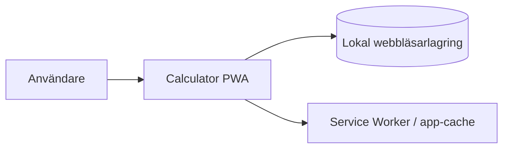

# Arkitektur – Calculator PWA v1

## 1. Arkitekturmål

Arkitekturen ska stödja följande mål i prioriterad ordning:

1. **Korrekt och testbar beräkningslogik** – matematiska regler ska vara isolerade från presentationen och kunna verifieras med omfattande enhetstester.
2. **Mycket enkel användning i Enkel-läge** – avancerade funktioner ska inte skapa visuell eller teknisk komplexitet i grundflödet.
3. **Full lokal funktion** – all kärnfunktionalitet ska fungera utan backend och, efter första lyckade laddningen, utan nätverk.
4. **Responsivt och tillgängligt gränssnitt** – samma kodbas ska fungera på mobil och desktop med både pekskärm och tangentbord.
5. **Liten drift- och beroendeyta** – inga serverkomponenter, databaser eller externa API:er ska krävas för v1.
6. **Förutsägbar uppdatering** – en ny PWA-version ska inte bytas mitt under en pågående beräkning.

## 2. Systemkontext

Calculator PWA är en helt klientbaserad webbapplikation. Den enda primära aktören är användaren.



Det finns i v1:

- ingen backend,
- ingen autentisering,
- ingen serverdatabas,
- inga externa API-anrop i kärnflödet,
- ingen synkronisering mellan enheter.

Webbserver/CDN används endast för att leverera den statiska applikationen och nya versioner.

## 3. Huvudkomponenter

### 3.1 Application Shell / React UI

Ansvarar för:

- huvudlayout,
- Enkel/Avancerad-växling,
- display för uttryck/resultat/fel,
- knappsatser,
- historikpanel,
- minnesindikering,
- tema och DEG/RAD-kontroll,
- responsiv layout,
- tillgänglig semantik och fokusbeteende.

UI:t ska inte implementera matematiska regler. Det skickar användarens avsikt till calculator state/domain-lagret och renderar resultatet.

### 3.2 Calculator State / Application Logic

Ansvarar för det interaktiva miniräknartillståndet:

- aktuellt uttryck,
- inmatningsläge,
- resultat/feltillstånd,
- efterföljande beräkning efter `=`,
- radering/nollställning,
- val av Enkel/Avancerad,
- DEG/RAD,
- koordinering av historik och minne.

Lagret ska vara oberoende av React-komponenternas visuella struktur så långt det är praktiskt.

### 3.3 Expression Engine

Ansvarar exklusivt för matematiskt innehåll:

- tokenisering av tillåten syntax,
- parsing med korrekt operatorprioritet,
- parenteser,
- unära operatorer,
- procent,
- potenser,
- `sin`, `cos`, `tan`, `log`, `ln`, `sqrt`, invers,
- konstanterna `π` och `e`,
- DEG/RAD-konvertering,
- domänfel och division med noll.

Motorn ska använda explicit parser/evaluator och får inte använda `eval`, `Function` eller annan generell JavaScript-exekvering.

För v1 implementeras den begränsade syntaxen internt i projektet i stället för att införa ett generellt matematikbibliotek. Detta minskar bundle-storlek och dependency-/supply-chain-yta och gör procentsemantiken helt kontrollerbar.

En Pratt-parser eller shunting-yard-baserad parser är lämplig. Exakt intern parseralgoritm är en implementationsdetalj så länge operatorprioritet, associativitet och funktionssyntax är explicit och testad.

### 3.4 Numeric Formatter

Ansvarar för att separera intern beräkning från presentation:

- normalisering av mycket små flyttalsartefakter,
- rimlig avrundning för visning,
- vetenskaplig notation vid mycket stora/små värden,
- konsekvent presentation av `-0`, `NaN` och infinita/ogiltiga resultat som definierade UI-tillstånd.

V1 använder JavaScript `Number` och lovar inte godtycklig precision.

### 3.5 Persistence Adapter

Ett litet adapterlager kapslar webbläsarlagring och ansvarar för:

- senast valda läge,
- tema,
- DEG/RAD,
- minnesvärde,
- historik.

`localStorage` är förstahandsval eftersom datamängden är liten och strukturen enkel. Åtkomst ska kapslas och felhanteras så att miniräknaren fortfarande fungerar om lagring är blockerad, full eller rensad.

Historiken begränsas i v1 till de **100 senaste** slutförda avancerade beräkningarna. När gränsen överskrids tas äldsta posten bort.

### 3.6 PWA / Service Worker

PWA-lagret ansvarar för:

- web app manifest,
- installerbarhet där plattformen stödjer det,
- precache av applikationsskal och statiska resurser,
- offline-start efter första lyckade laddningen,
- upptäckt av ny applikationsversion.

Service worker genereras via `vite-plugin-pwa`/Workbox i stället för handskriven cachelogik.

Uppdateringsstrategin ska vara **prompt/reload**, inte tvingad automatisk omladdning. En ny service worker får installeras i bakgrunden, men användaren ska byta till den nya versionen genom en kontrollerad reload så att en pågående beräkning inte avbryts oväntat.

## 4. Ansvar och beroendegränser

Den huvudsakliga beroenderiktningen är:

```text
React UI
  -> Calculator State
      -> Expression Engine
      -> Numeric Formatter
      -> Persistence Adapter

PWA runtime är ortogonalt till domänlagret och ska inte behövas för beräkning.
```

Regler:

- Expression Engine får inte importera React, DOM-API:er eller storage.
- Numeric Formatter ska vara ren och testbar utan browser.
- Persistence Adapter får inte innehålla matematik- eller UI-regler.
- React-komponenter får inte duplicera operatorprioritet eller annan uttryckssemantik.
- Service worker får inte vara en förutsättning för att appen fungerar online i vanlig webbläsare.

## 5. Viktiga dataflöden

### 5.1 Grundläggande beräkning

```text
Användare
-> knapp/tangentbord
-> UI event
-> Calculator State
-> Expression Engine vid utvärdering
-> Numeric Formatter
-> Calculator State
-> UI-display
```

### 5.2 Slutförd avancerad beräkning

```text
Expression Engine
-> resultat
-> Numeric Formatter
-> Calculator State
-> historikpost
-> Persistence Adapter
-> localStorage
```

Historikskrivning är sekundär. Ett storage-fel får inte göra en lyckad matematisk beräkning till ett fel.

### 5.3 Offline-start

```text
Browser navigation
-> Service Worker
-> precached app shell/assets
-> React application
-> Persistence Adapter
-> lokal state/historik
```

Ingen nätverksresurs ska behövas för kärnberäkningar efter att appversionen har cachelagrats.

## 6. Data och ägarskap

All användardata ägs lokalt av applikationen i användarens webbläsarprofil.

### Persistenta informationsobjekt

- `settings`
  - mode: simple/advanced
  - angleMode: DEG/RAD
  - theme: system/light/dark
- `memory`
  - numeriskt värde eller tomt minne
- `history`
  - uttryck
  - formatterat resultat
  - tidsstämpel/ordning

Aktuellt, ännu inte slutfört uttryck behöver inte persisteras i v1.

Persistensformatet ska versionsmärkas eller kunna migreras defensivt om strukturen senare ändras. Ogiltig lokal data ska ignoreras/återställas utan att appen kraschar.

## 7. Integrationer

V1 har inga externa affärsintegrationer.

Den enda plattformsintegrationen är webbläsarens standard-API:er för:

- DOM/input,
- localStorage,
- Service Worker,
- Web App Manifest,
- media query för systemtema.

PWA-installations-UI betraktas som progressive enhancement och varierar mellan plattformar.

## 8. Säkerhetsarkitektur

Säkerhetsytan är liten men följande principer är bindande:

- användarens uttryck tolkas enbart som tillåten matematisk syntax,
- ingen `eval`, `Function` eller dynamisk kodgenerering,
- ingen användardata skickas externt,
- inga secrets/API-nycklar finns i klienten,
- tredjepartsdependencies hålls få och låses i lockfil,
- inputgränser införs för orimligt långa uttryck för att undvika onödig CPU-/minnesbelastning,
- lagringsdata valideras innan den används.

En rimlig initial gräns är **1 000 tecken per uttryck**, vilket vida överstiger normal interaktiv användning men ger ett tydligt skydd mot oavsiktligt extrema uttryck.

## 9. Deploymentmodell

Applikationen byggs till statiska filer och kan distribueras på valfri HTTPS-kapabel statisk webbhosting/CDN.

```text
Source
-> Vite build
-> static dist/
-> HTTPS static host/CDN
-> browser + service worker cache
```

Ingen container krävs för runtime i v1. En container kan senare användas som paketerings-/hostingalternativ utan att applikationsarkitekturen behöver ändras.

Krav på driftmiljön:

- HTTPS i produktion (för PWA/service worker),
- korrekt fallback till `index.html` om klientrouting senare införs,
- korrekta MIME-typer,
- möjlighet att leverera manifest, ikoner och service worker-filer.

V1 behöver ingen server-side health endpoint. Tillgänglighet övervakas i så fall på hosting-/HTTP-nivå.

## 10. Observability och operability

För v1 behövs ingen central telemetry eller användarspårning.

Operativa principer:

- build/test ska vara deterministiska,
- produktionsbygget ska kunna verifieras lokalt via preview-server,
- PWA-manifest och service worker ska verifieras i test/acceptans,
- runtime-fel får loggas till browser console i utvecklingsläge men ingen extern felinsamling är krav i v1,
- en uppdateringsindikering ska ge användaren möjlighet att ladda om när ny version är klar.

## 11. Teknikval

### 11.1 Språk

**TypeScript** för all applikationskod.

Motiv:

- starkare kontrakt mellan UI, state och expression engine,
- lämpligt för explicit token-/AST-modell,
- stödjer refaktorering och testbarhet utan extra runtime.

### 11.2 UI

**React**.

Motiv:

- komponentbaserad struktur passar de två UI-lägena och responsiva delarna,
- state/rendering kan hållas separerad från den rena matematikdomänen,
- mogen test- och tillgänglighetsekosystem.

Ingen separat global state-management-dependency införs initialt. React state/reducer och små rena domänmoduler är tillräckligt för v1.

### 11.3 Build/dev server

**Vite**.

Motiv:

- liten konfiguration för React/TypeScript,
- snabb lokal utveckling,
- statiskt produktionsbygge,
- enkel integration med vald PWA-plugin.

### 11.4 PWA

**vite-plugin-pwa** med Workbox-genererad service worker och manifest.

Vald strategi:

- precache av byggda resurser,
- offline app-shell,
- promptbaserad versionsuppdatering,
- inga runtime-cachade externa API:er eftersom sådana saknas.

### 11.5 Matematikmotor

**Egen begränsad parser/evaluator i TypeScript**.

Motiv:

- v1-syntaxen är avgränsad,
- inga behov av symbolisk algebra, matriser eller CAS,
- full kontroll över procent, DEG/RAD och felmodell,
- färre runtime-dependencies.

Om utvecklingen visar att parsern blir väsentligt större eller mer riskfylld än beräknat ska beslutet omprövas innan scope utökas.

### 11.6 Persistens

**localStorage bakom adapter**.

IndexedDB bedöms vara onödigt för den lilla datamängden i v1.

### 11.7 Test

**Vitest** för:

- expression engine,
- numeric formatter,
- calculator state,
- storage adapter,
- komponent-/interaktionstester där lämpligt.

**React Testing Library** används för beteendeorienterade UI-tester.

**Playwright** används för end-to-end-flöden:

- Enkel/Avancerad,
- tangentbord,
- responsiva vyer,
- historik/persistens,
- PWA/offline-verifiering,
- grundläggande cross-browser-verifiering.

Service-worker-specifika assertions koncentreras till Chromium där testverktygets service-worker-inspektion har bäst direktstöd; kärn-UI och matematik ska även testas utan beroende av service worker.

### 11.8 Kodkvalitet

- ESLint för statisk kodkontroll.
- TypeScript strict mode.
- Formatteringsverktyg kan införas i baseline-steget; det är inte ett arkitekturbeslut.

## 12. Föreslagen källkodsstruktur

Detta är en riktning, inte ett krav på exakt filstruktur:

```text
src/
  app/
    App.tsx
  calculator/
    engine/
      tokenizer.ts
      parser.ts
      evaluator.ts
      types.ts
    state/
    formatting/
  components/
  persistence/
  pwa/
  styles/
  test/
```

Principen är viktigare än mapparna: ren matematikdomän ska inte blandas med React eller browserpersistens.

## 13. Trade-offs och constraints

### Egen parser kontra matematikbibliotek

Egen parser innebär mer kod som måste verifieras noggrant, men scope är tillräckligt begränsad för att vinsten i kontroll och liten dependency-yta väger tyngre i v1. RISK-001 hanteras därför med test-first-liknande utveckling av expression engine och en stor tabell av acceptansfall.

### `Number` kontra godtycklig precision

JavaScript `Number` ger små flyttalsartefakter men är tillräckligt för målgruppen. Arkitekturen kompenserar med central formattering i stället för att introducera ett arbitrary-precision-bibliotek.

### localStorage kontra IndexedDB

localStorage är synkront men datamängden är mycket liten. Adaptern håller bytet möjligt om framtida scope kräver större eller mer strukturerad lagring.

### Klient-only kontra backend

Avsaknaden av backend gör synkronisering mellan enheter omöjlig i v1 men ger maximal offlineförmåga, integritet och enkel drift. Det matchar aktuell scope.

## 14. Arkitekturbeslut

Följande beslut betraktas som låsta för v1 tills ett konkret problem motiverar ändring:

- ARCH-001: klientbaserad statisk PWA utan backend.
- ARCH-002: React + TypeScript + Vite.
- ARCH-003: egen explicit expression parser/evaluator; ingen dynamisk kodexekvering.
- ARCH-004: JavaScript `Number` + central resultatformatterare.
- ARCH-005: localStorage bakom adapter, historik max 100 poster.
- ARCH-006: `vite-plugin-pwa`/Workbox med promptbaserad uppdatering.
- ARCH-007: Vitest + React Testing Library + Playwright som testbas.

Separata ADR-filer behövs inte ännu eftersom projektet är litet och besluten är dokumenterade här. Om ett av besluten senare ändras eller blir omtvistat ska separat ADR skapas.

## 15. Öppna arkitekturfrågor

Inga blockerande frågor återstår före utvecklingsplanering.

Detaljer som ska bestämmas i implementation/development plan, utan att de ändrar arkitekturen:

- exakt parseralgoritm,
- exakt visningsprecision/avrundningspolicy,
- exakt responsiv breakpoint-layout,
- ikon-/manifestgrafik,
- eventuell formatterare utöver ESLint.

## 16. Konsekvenser för nästa steg

Development plan ska prioritera riskreduktion i denna ordning:

1. skapa körbar React/TypeScript/Vite-baseline med test/lint/typecheck,
2. implementera och verifiera expression engine + formattering tidigt,
3. bygga Enkel-lägets kompletta flöde,
4. lägga till avancerad matematik och DEG/RAD,
5. införa lokal persistens, minne och historik,
6. färdigställa responsiv/tillgänglig UI-design och tangentbord,
7. lägga till PWA/offline och uppdateringsflöde,
8. end-to-end-, cross-browser- och acceptansverifiering,
9. paketering/release readiness.
