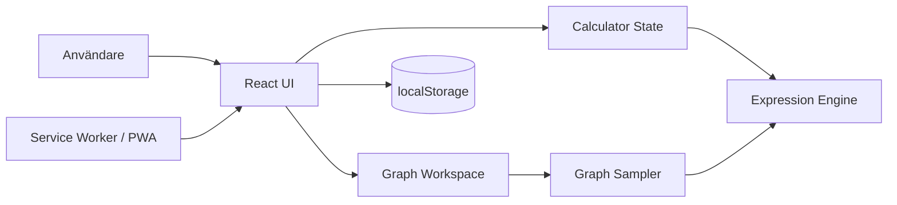

# Arkitektur – Calculator PWA

## 1. Arkitekturmål

Arkitekturen ska prioritera:

1. korrekt och testbar matematik,
2. ett enkelt grundflöde utan separata calculator modes,
3. stabil responsiv layout där grundknappsatsen inte flyttar sig när sekundär funktionalitet ändras,
4. helt lokal/offlinekapabel funktion utan backend,
5. liten dependency- och drift-yta,
6. tydliga domängränser mellan beräkning, grafprovtagning och rendering.

## 2. Systemkontext

Calculator PWA är en klientbaserad React/TypeScript-applikation som levereras statiskt och kör all matematik, grafprovtagning, rendering och persistens lokalt i webbläsaren.



Det finns ingen backend, autentisering, serverdatabas eller extern graph service.

## 3. Huvudkomponenter

### 3.1 Application Shell / React UI

Ansvarar för:

- expression/result display,
- grundknappsats,
- `Funktioner` och `Historik`,
- DEG/RAD, minne och tema,
- responsiv presentation,
- safe-area-hantering,
- orienterings-/viewportberoende graph workspace,
- tillgänglig semantik och input/fokus.

UI:t implementerar inte matematiska regler eller grafprovtagning.

### 3.2 Calculator State

Ansvarar för:

- aktuellt uttryck,
- numeriskt resultat/fel,
- redigering, clear/backspace och `=`,
- DEG/RAD,
- minne,
- historik,
- tema/persistenskoordination.

Graph presentation ska härledas från aktuellt uttryck och viewport, inte lagras som ett separat calculator mode.

### 3.3 Expression Engine

Ansvarar för säker parser/evaluator för:

- tal och operatorer,
- parenteser och unära operatorer,
- procent/potenser,
- `sin`, `cos`, `tan`, `log`, `ln`, `sqrt`, invers och kvadrat,
- `π` och `e`,
- DEG/RAD,
- variabeln `x` via explicit evaluation context,
- kontrollerade syntax-, domän-, divisions- och resultatfel.

Motorn får inte använda `eval`, `Function` eller dynamisk kodexekvering.

Föreslaget domän-API:

```text
evaluateExpression(expression, angleMode, variables?) -> number
variables = { x?: number }
```

Uttryck utan variabler behåller befintlig semantik. Om `x` refereras utan explicit värde ska direct evaluation ge ett kontrollerat fel.

### 3.4 Numeric Formatter

Ansvarar för presentation av numeriska resultat, avrundning, `-0`, mycket stora/små tal och vetenskaplig notation. Grafdomänen använder råa `number`-värden och ska inte formatera varje sample via UI-formattering.

### 3.5 Graph Sampler

Graph Sampler är ett rent domänlager mellan expression engine och rendering.

Ansvar:

- ta emot uttryck, angle mode och matematisk viewport,
- generera representativa x-samples,
- utvärdera uttrycket genom Expression Engine med `{ x }`,
- behandla domän-/resultatfel som avbrott i kurvan,
- dela output i drawable segments,
- undvika uppenbara falska förbindelser över asymptoter/diskontinuiteter,
- vara oberoende av React, DOM och Canvas.

Exempel på output:

```text
GraphSampleResult
  segments[]
    points[] { x, y }
```

Sampler-strategin ska kunna bytas utan att UI/Canvas behöver känna till parserdetaljer.

### 3.6 Graph Canvas

Graph Canvas ansvarar endast för visning:

- matematisk koordinat → pixelkoordinat,
- axlar och grid,
- rendering av segment,
- device pixel ratio,
- tema,
- viewportinteraktion i senare steg.

Canvas ska inte själv evaluera uttryck eller försöka avgöra matematiska diskontinuiteter.

### 3.7 Persistence Adapter

`localStorage` kapslas bakom befintlig adapter och lagrar:

- tema,
- DEG/RAD,
- minne,
- max 100 historikposter.

Initial graphing-scope kräver ingen schemaändring. Aktuellt uttryck, graph samples och viewport är session-/UI-state och behöver inte persisteras.

Legacy-data som innehåller äldre mode-fält ska fortsatt kunna läsas defensivt och ignoreras.

### 3.8 PWA / Service Worker

`vite-plugin-pwa`/Workbox levererar app shell och resurser offline. Grafstöd ska inte kräva nya nätverksanrop och blir därför en del av samma statiska/offlinekapabla bundle.

## 4. Responsiv workspace-arkitektur

### Porträtt

- Grundknappsats är primär.
- Vetenskapliga funktioner visas via `Funktioner` på små skärmar.
- `x` kan matas in via funktionsytan.
- Ingen permanent graph surface i initial scope.
- Ett grafbart uttryck kan indikera att graf finns i landskap.

### Landskap

Layouten består av två stabila områden:

```text
┌────────────────────┬────────────────────────┐
│ Calculator column  │ Secondary workspace    │
│ display/result     │ functions OR graph     │
│ numeric keypad     │                        │
│ actions            │                        │
└────────────────────┴────────────────────────┘
```

Calculator column ska behålla samma geometri när secondary workspace växlar innehåll.

Utan `x` får secondary workspace visa vetenskapliga funktioner permanent.

Med `x` visas grafen som standard. `Funktioner` öppnar då scientific controls i eller över secondary workspace utan att flytta numeric keypad.

Historik förblir on demand.

## 5. Dataflöden

### 5.1 Numerisk beräkning

```text
Input
→ Calculator State
→ Expression Engine
→ Numeric Formatter
→ State/history
→ UI
```

### 5.2 Graf

```text
Expression containing x
→ Graph Workspace
→ Graph Sampler(viewport, expression, angleMode)
→ Expression Engine(expression, angleMode, {x}) repeated
→ curve segments
→ Graph Canvas
```

Enskilda evaluation errors under sampling ska inte bli ett globalt calculator error; de skapar normalt segmentavbrott.

### 5.3 Viewportinteraktion

I DEV-017:

```text
pointer/wheel/touch
→ viewport transform
→ Graph Sampler
→ Graph Canvas repaint
```

Graph gestures ska vara begränsade till graph surface och inte förändra calculator controls.

## 6. Data och ägarskap

Persistenta objekt:

- settings: `angleMode`, `theme`,
- memory,
- history.

Temporära graph-objekt:

- current graphable expression,
- mathematical viewport,
- sampled segments.

Expression engine äger matematiksemantik. Graph Sampler äger sampling/discontinuity-policy. Canvas äger pixelrendering. UI äger layout/presentation.

## 7. Felmodell

Direkt kalkylatorutvärdering visar kontrollerade fel för syntax, division med noll, domän, saknad variabel och icke-visningsbart resultat.

Graph Sampler behandlar motsvarande fel för enskilda `x`-värden som lokala sampling gaps när det är matematiskt rimligt.

Ett programmerings-/systemfel får inte döljas som en matematisk diskontinuitet.

## 8. Säkerhetsarkitektur

- inga externa graph-/math-API:er,
- ingen dynamisk kodexekvering,
- inputgräns kvarstår,
- inga secrets,
- lokal beräkningsdata,
- dependencies låses i lockfil,
- Canvas renderar endast intern numerisk data och text som redan är UI-kontrollerad.

## 9. Prestanda

Graphing introducerar upprepad expression evaluation. Därför gäller:

- sampling density ska vara begränsad/proportionerlig till viewport,
- omritning ska undvika onödigt arbete,
- pan/zoom får throttlas via browser rendering cadence när det behövs,
- DOM-element per graph sample ska undvikas; Canvas är default,
- prestanda ska verifieras på mobilklassad viewport/hårdvara i acceptans.

Web Worker införs inte initialt men kan övervägas om mätning visar UI-blockering.

## 10. Deployment och drift

Deploymentmodellen förändras inte:

```text
Source → Vite build → statiska filer → GitHub Pages/HTTPS → PWA cache
```

Graphing kräver ingen serverkonfiguration, migration eller ny extern tjänst.

## 11. Teknikval

- TypeScript
- React
- Vite
- egen explicit expression parser/evaluator
- HTML Canvas 2D för graph rendering
- localStorage bakom adapter
- vite-plugin-pwa/Workbox
- Vitest + React Testing Library + Playwright

Ett externt plottingbibliotek ska endast införas om DEV-014/DEV-015 visar att den interna Canvas-lösningen inte ger tillräcklig korrekthet eller underhållbarhet. Ett sådant byte kräver ny dependency-/bundle-/security-bedömning.

## 12. Arkitekturbeslut

- ARCH-001: klientbaserad statisk PWA utan backend.
- ARCH-002: React + TypeScript + Vite.
- ARCH-003: egen explicit parser/evaluator utan dynamisk kodexekvering.
- ARCH-004: JavaScript `Number` + central formattering.
- ARCH-005: localStorage bakom adapter, historik max 100 poster.
- ARCH-006: vite-plugin-pwa/Workbox.
- ARCH-007: Vitest + RTL + Playwright.
- ARCH-008: graphing använder samma Expression Engine med explicit variable context.
- ARCH-009: Graph Sampler är ett separat rent domänlager mellan evaluator och renderer.
- ARCH-010: Canvas 2D är default-renderer för initial graphing-scope.
- ARCH-011: graph presentation är expression-/viewport-driven och inte ett separat calculator mode.
- ARCH-012: landscape calculator column är spatialt stabil; secondary workspace byter mellan functions och graph.

## 13. Viktiga trade-offs

### Graph endast i initial landskapsyta

Det håller phone portrait enkelt och ger grafen meningsfull yta. Nackdelen är att användaren behöver rotera en smal telefon för att se grafen. Uttrycket och `x`-input fungerar dock fortfarande i porträtt så rotationen förlorar inte arbetet.

### Canvas kontra SVG/plotting library

Canvas ger liten dependency-yta och lämpar sig för många sampled points. Det ger mindre native DOM-semantik, vilket kompenseras med tillgängliga kontroller/labels utanför canvas.

### Sampling kontra symbolisk analys

Initial version provar funktionen numeriskt i stället för att analysera den symboliskt. Det håller scope rimligt men kräver försiktig discontinuity-policy och betyder att perfekt identifiering av alla asymptoter inte garanteras.

## 14. Öppna arkitekturfrågor

Inga blockerande frågor för DEV-013. DEV-014 ska ge evidens för sampling density/discontinuity threshold innan Canvas/UI integreras.
